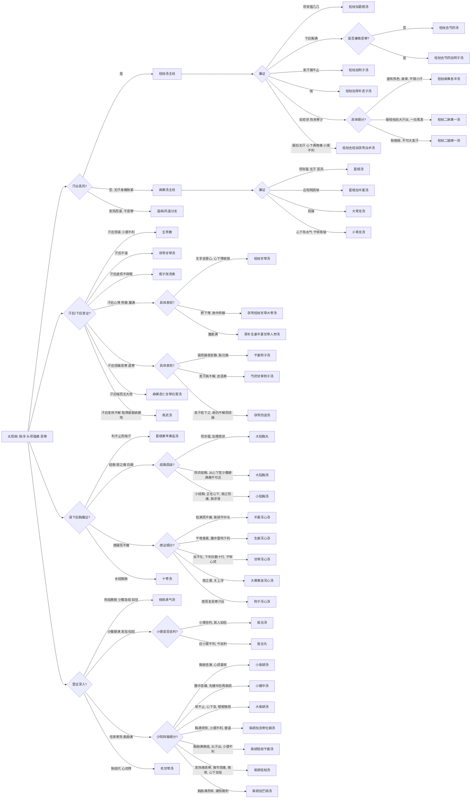

# 太阳病诊疗流程

## 基本定义与识别要点
**太阳病**为外感之始，主表，亦最容易因误汗、误下、误吐、火劫而迅速转入复杂变证。

- **提纲条文：** 太阳之为病，脉浮、头项强痛而恶寒。
- **基本分型：**
  - **中风：** 发热、汗出、恶风、脉缓。
  - **伤寒：** 或已发热、或未发热，必恶寒、体痛、呕逆、脉阴阳俱紧。
  - **温病/风温：** 发热而渴，不恶寒；误汗后可见身灼热、自汗、多眠、鼻鼾等。

> 太阳病在《伤寒论》中不是只有“桂枝汤 / 麻黄汤 / 大青龙汤 / 小青龙汤”四类，原文实际上展开成了 **表证、合方、误治后救逆、蓄水、蓄血、结胸、痞、并病、火逆、风湿、结代** 等多条支线。下面按《辨太阳病脉证并治上 / 中 / 下》重新补齐。

## 太阳病总决策树

## 一、太阳上：桂枝主线、麻黄主线、桂麻合方类

### 1) 桂枝汤主线

| 条文 | 关键证候 | 方剂 | 说明 |
| --- | --- | --- | --- |
| 12、13 | 发热、汗出、恶风、鼻鸣干呕，脉浮缓 | **桂枝汤** | 太阳中风主方；解肌、调和营卫 |
| 14 | 项背强几几，反汗出恶风 | **桂枝加葛根汤** | 现有版本之前只写了名称，现补入主线 |
| 18、43 | 桂枝证兼喘 | **桂枝加厚朴杏子汤** | 兼降逆平喘 |
| 20 | 发汗后漏汗不止，恶风，小便难，四肢微急难屈伸 | **桂枝加附子汤** | 太阳误汗后表虚阳伤 |
| 21 | 下后脉促、胸满 | **桂枝去芍药汤** | 胸阳不利、胸满为主 |
| 22 | 上证兼微恶寒 | **桂枝去芍药加附子汤** | 在胸满基础上兼阳虚 |
| 28 | 服桂枝或误下后，仍头项强痛、发热、无汗、心下满微痛、小便不利 | **桂枝去桂加茯苓白术汤** | 去桂不解表，改走利水化气 |

### 2) 桂麻合方类 —— 这是你指出最容易漏掉的一组

| 条文 | 关键证候 | 方剂 | 位置 |
| --- | --- | --- | --- |
| 23 | 八九日如疟状，发热恶寒，热多寒少，脉微缓，面有热色，身痒，不得小汗 | **桂枝麻黄各半汤** | 太阳上 · 小汗不出、表郁未尽 |
| 25 | 服桂枝汤后大汗出，形似疟，一日再发 | **桂枝二麻黄一汤** | 太阳上 · 桂枝为主、兼取麻黄 |
| 27 | 发热恶寒，热多寒少，脉微弱，不可大发汗 | **桂枝二越婢一汤** | 太阳上 · 微兼里热、石膏入方 |

### 3) 桂枝误用后的救逆链

| 条文 | 误治后表现 | 补救方 |
| --- | --- | --- |
| 29、30 | 自汗、小便数、脚挛急，误与桂枝后厥、咽干、烦躁、吐逆 | **甘草干姜汤 → 芍药甘草汤 → 调胃承气汤（少量） → 四逆汤** |
| 24 | 初服桂枝反烦不解 | **先刺风池、风府，再与桂枝汤** |
| 26 | 服桂枝后大汗出、大烦渴不解、脉洪大 | **白虎加人参汤** |

### 4) 麻黄主线

| 条文 | 关键证候 | 方剂 | 说明 |
| --- | --- | --- | --- |
| 35、51、52、55 | 头痛、发热、身疼、腰痛、骨节疼痛、恶风、无汗而喘，脉浮紧/浮数 | **麻黄汤** | 太阳伤寒表实主方 |
| 31、32 | 项背强几几、无汗、恶风；或太阳与阳明合病下利 | **葛根汤** | 太阳表实兼项背拘急、兼下利 |
| 33 | 葛根汤证兼呕 | **葛根加半夏汤** | 解表升津兼降逆止呕 |
| 34 | 桂枝证误下后，利遂不止，喘而汗出 | **葛根黄芩黄连汤** | 协热下利、表未解里已热 |
| 38、39 | 脉浮紧、发热恶寒、身疼、不汗出而烦躁 | **大青龙汤** | 表寒郁热，兼烦躁 |
| 40、41 | 表不解，心下有水气，干呕、发热而咳，或渴、或利、或噎、或喘 | **小青龙汤** | 外寒内饮主方 |

## 二、太阳中：汗后变证、蓄水、虚烦、少阳转属

### 1) 汗后、下后、吐后常见变方

| 条文 | 关键证候 | 方剂 |
| --- | --- | --- |
| 61 | 下后复发汗，昼烦躁夜安静，不呕不渴，无大热，脉沉微 | **干姜附子汤** |
| 62 | 发汗后身疼痛，脉沉迟 | **桂枝加芍药生姜各一两人参三两新加汤** |
| 63、162 | 汗出而喘，无大热 | **麻黄杏仁甘草石膏汤** |
| 64 | 发汗过多，叉手自冒心，心下悸欲按 | **桂枝甘草汤** |
| 65 | 发汗后脐下悸，欲作奔豚 | **茯苓桂枝甘草大枣汤** |
| 66 | 发汗后腹胀满 | **厚朴生姜半夏甘草人参汤** |
| 67 | 吐下后，心下逆满、气上冲胸、起则头眩、脉沉紧 | **茯苓桂枝白术甘草汤** |
| 68 | 发汗病不解，反恶寒，属虚 | **芍药甘草附子汤** |
| 69 | 发汗若下之，病仍不解而烦躁 | **茯苓四逆汤** |
| 70、94、105、123 | 发汗后但热不恶寒，或欲下之、过经谵语 | **调胃承气汤** |

### 2) 蓄水、水逆、烦渴系统

| 条文 | 关键证候 | 方剂 | 说明 |
| --- | --- | --- | --- |
| 71、72 | 发汗后脉浮数、烦渴、小便不利、微热、消渴 | **五苓散** | 太阳蓄水核心方 |
| 73 | 伤寒汗出而渴 | **五苓散** | 渴属水停气化不利 |
| 73 | 汗出而不渴 | **茯苓甘草汤** | 水停胃中、未至蓄水重证 |
| 74 | 中风六七日不解而烦，渴欲饮水，水入则吐 | **五苓散** | 经典“水逆” |
| 141、156 | 冷水逼汗后烦，或泻心汤后痞不解而渴烦、小便不利 | **五苓散** | 太阳下篇仍属蓄水 / 水热互结 |

### 3) 虚烦、懊憹、不得眠系统

| 条文 | 关键证候 | 方剂 |
| --- | --- | --- |
| 76、77、78 | 发汗、吐下后虚烦不得眠，心中懊憹，胸中窒或身热不去 | **栀子豉汤** |
| 76 | 上证兼少气 | **栀子甘草豉汤** |
| 76 | 上证兼呕 | **栀子生姜豉汤** |
| 79 | 伤寒下后心烦、腹满、卧起不安 | **栀子厚朴汤** |
| 80 | 丸药大下后，身热不去、微烦 | **栀子干姜汤** |

### 4) 阳虚水动与少阳转属

| 条文 | 关键证候 | 方剂 |
| --- | --- | --- |
| 82 | 汗出不解，仍发热，心下悸、头眩、身瞤动、振振欲擗地 | **真武汤** |
| 96、97、99、101 | 往来寒热、胸胁苦满、默默不欲饮食、心烦喜呕 | **小柴胡汤** |
| 100、102 | 阳脉涩阴脉弦腹中急痛，或伤寒二三日心中悸而烦 | **小建中汤** |
| 103 | 柴胡证仍在，呕不止、心下急、郁郁微烦 | **大柴胡汤** |
| 104 | 先宜小柴胡解外，后微下 | **柴胡加芒硝汤** |
| 107 | 下后胸满烦惊、小便不利、谵语、一身尽重，不可转侧 | **柴胡加龙骨牡蛎汤** |

### 5) 蓄血系统

| 条文 | 关键证候 | 方剂 | 说明 |
| --- | --- | --- | --- |
| 106 | 太阳病不解，热结膀胱，其人如狂，少腹急结 | **桃核承气汤** | 先解外，后攻里 |
| 124、125 | 六七日表证仍在，脉微沉，其人发狂；或少腹硬满、小便自利、如狂 | **抵当汤** | 瘀热在下焦 |
| 126 | 伤寒有热，少腹满，应小便不利，今反利 | **抵当丸** | 蓄血较缓而仍须攻下 |

## 三、太阳下：结胸、痞、水结、火逆、风湿

### 1) 结胸与小结胸

| 条文 | 关键证候 | 方剂 |
| --- | --- | --- |
| 131 | 误下后成结胸，项亦强，如柔痉状 | **大陷胸丸** |
| 134、135、136、137 | 心下硬痛、按之石硬、热实结胸，或从心下至少腹硬满痛不可近 | **大陷胸汤** |
| 138 | 小结胸，正在心下，按之则痛，脉浮滑 | **小陷胸汤** |
| 141 | 寒实结胸，无热证 | **白散**（原文亦云可与三物小陷胸汤） |
| 141 | 冷水逼汗后，意欲饮水反不渴 | **文蛤散** |

### 2) 痞证系统

| 条文 | 关键证候 | 方剂 |
| --- | --- | --- |
| 149 | 心下满而不痛，属痞 | **半夏泻心汤** |
| 154 | 心下痞，按之濡，关上浮 | **大黄黄连泻心汤** |
| 155 | 心下痞而复恶寒、汗出 | **附子泻心汤** |
| 157 | 汗出解后，胃中不和，干噫食臭，腹中雷鸣下利 | **生姜泻心汤** |
| 158 | 下利日数十行，谷不化，腹中雷鸣，心下痞硬而满，干呕心烦 | **甘草泻心汤** |
| 159 | 下利不止，心下痞硬，服泻心汤后复下之而利不止 | **赤石脂禹余粮汤** |
| 161 | 发汗吐下解后，心下痞硬，噫气不除 | **旋复代赭汤** |
| 163 | 外证未除而数下之，遂协热而利，心下痞硬、表里不解 | **桂枝人参汤** |

### 3) 水结胸胁、胸中寒、吐法

| 条文 | 关键证候 | 方剂 |
| --- | --- | --- |
| 152 | 表解里未和，心下痞硬满，引胁下痛，干呕短气，汗出不恶寒 | **十枣汤** |
| 166 | 病如桂枝证而头项不强，胸中痞硬，气上冲咽不得息 | **瓜蒂散** |

### 4) 太阳少阳并病、血室、兼证

| 条文 | 关键证候 | 方剂 / 处理 |
| --- | --- | --- |
| 142、171 | 太阳少阳并病，头项强痛、眩冒、心下痞硬 | **刺大椎、肺俞、肝俞**；慎勿发汗下之 |
| 143 | 妇人中风，经水适来，热除脉迟、胸胁下满、谵语 | **刺期门** |
| 144 | 经水适断，寒热发作有时，如疟状 | **小柴胡汤** |
| 146 | 发热、微恶寒、肢节烦痛、微呕、心下支结、外证未去 | **柴胡桂枝汤** |
| 147 | 已发汗复下之，胸胁满微结、小便不利、头汗出、往来寒热、心烦 | **柴胡桂枝干姜汤** |

### 5) 火逆、烧针、奔豚、救逆

| 条文 | 关键证候 | 方剂 |
| --- | --- | --- |
| 112 | 火迫劫之，亡阳，惊狂卧起不安 | **桂枝去芍药加蜀漆牡蛎龙骨救逆汤** |
| 117 | 烧针后针处寒，核起而赤，气从少腹上冲心 | **桂枝加桂汤** |
| 118 | 火逆下之，因烧针烦躁 | **桂枝甘草龙骨牡蛎汤** |

### 6) 风湿与结代

| 条文 | 关键证候 | 方剂 |
| --- | --- | --- |
| 174 | 风湿相搏，身体疼烦，不能转侧，不呕不渴，脉浮虚涩 | **桂枝附子汤** |
| 174 | 上证兼大便硬、小便自利 | **去桂加白术汤** |
| 175 | 风湿相搏，骨节疼烦，掣痛不得屈伸，汗出短气，小便不利 | **甘草附子汤** |
| 176 | 脉浮滑，白虎汤证（原文有校勘争议） | **白虎汤** |
| 177 | 脉结代、心动悸 | **炙甘草汤** |

## 四、太阳病补全后的“方剂一览”

下面这张表专门用于核对“之前漏了哪些”，现在按原文已补入：

| 类别 | 已补入方剂 |
| --- | --- |
| 桂枝主线 | 桂枝汤、桂枝加葛根汤、桂枝加厚朴杏子汤、桂枝加附子汤、桂枝去芍药汤、桂枝去芍药加附子汤、桂枝去桂加茯苓白术汤 |
| 桂麻合方 | 桂枝麻黄各半汤、桂枝二麻黄一汤、桂枝二越婢一汤 |
| 麻黄 / 葛根主线 | 麻黄汤、葛根汤、葛根加半夏汤、葛根黄芩黄连汤、大青龙汤、小青龙汤 |
| 汗后救逆 | 干姜附子汤、桂枝新加汤、麻黄杏仁甘草石膏汤、桂枝甘草汤、茯苓桂枝甘草大枣汤、厚朴生姜半夏甘草人参汤、茯苓桂枝白术甘草汤、芍药甘草附子汤、茯苓四逆汤 |
| 蓄水 / 虚烦 | 五苓散、茯苓甘草汤、栀子豉汤、栀子甘草豉汤、栀子生姜豉汤、栀子厚朴汤、栀子干姜汤、真武汤 |
| 柴胡转属 | 小柴胡汤、小建中汤、大柴胡汤、柴胡加芒硝汤、柴胡加龙骨牡蛎汤、柴胡桂枝汤、柴胡桂枝干姜汤 |
| 蓄血 / 里实 | 调胃承气汤、桃核承气汤、抵当汤、抵当丸 |
| 结胸痞证 | 大陷胸丸、大陷胸汤、小陷胸汤、半夏泻心汤、大黄黄连泻心汤、附子泻心汤、生姜泻心汤、甘草泻心汤、赤石脂禹余粮汤、旋复代赭汤、桂枝人参汤、十枣汤 |
| 火逆 / 吐法 / 风湿 | 桂枝去芍药加蜀漆牡蛎龙骨救逆汤、桂枝加桂汤、桂枝甘草龙骨牡蛎汤、瓜蒂散、文蛤散、白散、桂枝附子汤、去桂加白术汤、甘草附子汤、炙甘草汤 |

## 五、基本禁忌与诊断提醒

- **桂枝汤禁忌：** 脉浮紧、无汗者不可与；酒客不喜甘，服桂枝则易呕。
- **麻黄汤禁忌：** 尺中迟、荣气不足、血少者不可妄汗。
- **栀子汤禁忌：** 平素便溏者不可与。
- **白虎汤/白虎加人参汤禁忌：** 表未解、恶寒、无大热者不可误用。
- **结胸与痞的鉴别：**
  - **结胸：** 按之痛，甚至石硬，多属可攻之实结。
  - **痞：** 心下痞硬而按之濡，多属胃虚气逆、寒热错杂，不可一概攻下。
- **蓄水与蓄血的鉴别：**
  - **蓄水：** 烦渴、小便不利、水入则吐、心下悸。
  - **蓄血：** 少腹急结或硬满、小便自利、如狂或发狂。
