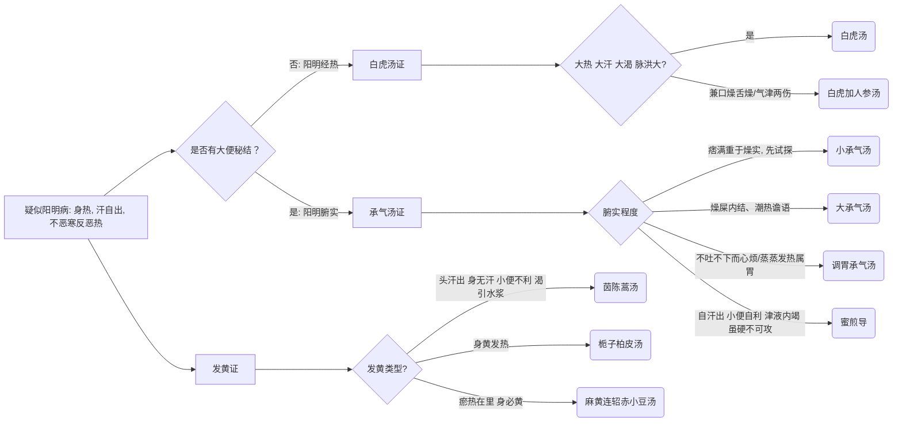

# 阳明病诊疗流程

## 基本定义与识别要点
**阳明病**为邪热入里，表现为胃家实。
**脉证提纲：** 阳明之为病，胃家实是也。外证：身热，汗自出，不恶寒反恶热。

## 阳明病辨证决策树

## 首选方剂与对照表

| 症状特征 | 脉象 | 诊断 | 首选方剂 | 常见加减/变证 |
| --- | --- | --- | --- | --- |
| 大热、大汗、大渴、脉洪大 | 洪大 | 阳明经病 (热证) | 白虎汤 | 气伤者加人参 (白虎加人参汤) |
| 潮热、谵语、大便秘结、腹满痛 | 沉实 | 阳明腑病 (实证) | 大承气汤 | 结热较轻用小承气汤或调胃承气汤 |
| 无汗、小便不利、身必发黄 | 沉数 | 阳明发黄证 | 茵陈蒿汤 | 伴表证(麻黄连轺赤小豆汤) |

## 基本用药条件与禁忌
- **白虎汤禁忌：** 表未解者不可用，无大热而恶寒者不可用。
- **承气汤禁忌：** 尚未形成燥屎结实者不可用；可用小承气汤试探，若不转失气，则不可用大承气汤强攻。

## 阳明篇原文方剂补全清单

| 条文 | 方剂 | 关键证候 | 提示 |
| --- | --- | --- | --- |
| 207、248、249 | **调胃承气汤** | 不吐不下而心烦；太阳病发汗不解蒸蒸发热属胃；吐后腹胀满 | 阳明轻下、调胃和中 |
| 208、209、212、215、217、220、238、241、242、252、253、254、255、256 | **大承气汤** | 潮热、谵语、燥屎、腹满痛、绕脐痛、喘冒不能卧等 | 阳明腑实主方 |
| 208、209、213、214、250、251、374 | **小承气汤** | 痞满偏重、燥屎未甚，或先作试探；下利谵语有燥屎 | 先和胃，再观转气 |
| 219、176 | **白虎汤** | 三阳合病自汗出；大热、大汗、大渴 | 阳明经热清解主方 |
| 222、168、169、170 | **白虎加人参汤** | 口燥舌燥、大渴、背微恶寒、热结在里而气津两伤 | 白虎汤基础上益气生津 |
| 223、319 | **猪苓汤** | 脉浮发热、渴欲饮水、小便不利；少阴下利兼渴烦 | 阳明与少阴均可见 |
| 225 | **四逆汤** | 脉浮迟，表热里寒，下利清谷 | 阳明篇中的寒证反例 |
| 228、221 | **栀子豉汤** | 下之而心中懊憹、饥不能食、但头汗出；舌上苔者 | 阳明误治后胸中郁热 |
| 229、230、231 | **小柴胡汤** | 胸胁满不去、不大便而呕、舌上白苔；过十日脉续浮 | 阳明兼少阳枢机不利 |
| 232、235 | **麻黄汤** | 脉但浮、无余证；阳明病发热无汗而喘 | 阳明仍有表实可汗 |
| 233 | **蜜煎导** / 猪胆汁导 | 自汗出、小便自利、津液内竭，虽硬不可攻 | 导法而非峻下 |
| 234、240 | **桂枝汤** | 脉迟、汗出多、微恶寒，表未解；脉浮虚者宜发汗 | 阳明兼表未解 |
| 236、260 | **茵陈蒿汤** | 但头汗出、身无汗、小便不利、渴引水浆，身黄如橘子色 | 阳明湿热发黄主方 |
| 237、257 | **抵当汤** | 喜忘、屎虽硬而大便反易、色黑；七八日不大便且有瘀血 | 阳明蓄血 |
| 243 | **吴茱萸汤** | 食谷欲呕，属阳明中寒 | 与热呕相反 |
| 244 | **五苓散** | 渴欲饮水、小便数，大便必硬 | 阳明由太阳转属时可见 |
| 247 | **麻子仁丸** | 趺阳脉浮涩，小便数，大便硬，脾约 | 润下缓攻代表方 |
| 259-262 | **栀子柏皮汤** / **麻黄连轺赤小豆汤** | 身黄发热；瘀热在里而身黄 | 发黄证分轻重与表里 |

## 阳明篇补充提醒

- 阳明篇并不只有“三承气 + 白虎汤”，还包括：**发黄、蓄血、导法、寒证反例、兼少阳证**。
- 尤其容易漏掉的条目有：`蜜煎导`、`麻子仁丸`、`栀子柏皮汤`、`麻黄连轺赤小豆汤`、`吴茱萸汤`、`抵当汤`。

## 阳明篇无方条文要点补全

| 条文范围 | 要点 | 已落入 md 的位置 |
| --- | --- | --- |
| 179-188 | 阳明来源、三种阳明（太阳阳明 / 正阳阳明 / 少阳阳明）、外证、转属过程、阳明脉大、与太阴转属鉴别 | 本文件“基本定义与识别要点” + 本表 |
| 189-206 | 阳明中风 / 中寒辨别、能食与不能食、谷瘅、无汗虚象、被火发黄、潮热、盗汗、欲衄、不可攻等禁忌 | 本文件决策树、禁忌说明 + 本表 |
| 210-218 | 谵语与郑声、生死判断、亡阳、循衣摸床、热入血室、过经乃可下、误汗致里实 | 本表 |
| 224-227 | 汗多而渴不可与猪苓汤、表热里寒反用四逆汤、胃中虚冷饮水则哕、能食则衄 | 本表 + 方剂补全清单 |
| 239 | 绕脐痛、烦躁、发作有时，为燥屎要点 | 本表 |
| 245-246 | 汗出太过亡津液，大便因硬；脉浮而芤，胃气生热 | 本表 |
| 258-259 | 下后不止可协热便脓血；身目发黄要于寒湿中求之 | 本表 + 发黄分支 |

> 这样处理后，阳明篇不仅“有方的条文”被记录，**无方的判断条文** 也已经进入 Markdown。

