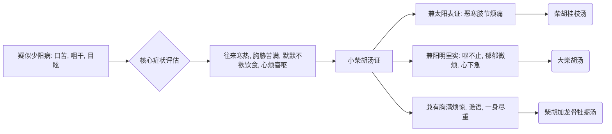

# 少阳病诊疗流程

## 基本定义与识别要点
**少阳病**处于半表半里，邪正相争。
**脉证提纲：** 少阳之为病，口苦，咽干，目眩也。

## 少阳病辨证决策树

## 首选方剂与对照表

| 症状特征 | 脉象 | 诊断 | 首选方剂 | 常见加减/变证 |
| --- | --- | --- | --- | --- |
| 往来寒热、胸胁苦满、心烦喜呕 | 弦象 | 少阳本证 | 小柴胡汤 | 变证甚多（随证去黄芩、大枣，加牡蛎、五味子等） |
| 胸胁满微结、小便不利、渴而不呕 | 弦细 | 少阳兼水饮 | 柴胡桂枝干姜汤 |
| 兼便秘、腹痛偏里实 | 弦实 | 少阳阳明合病 | 大柴胡汤 |

## 基本用药条件与禁忌
- **禁忌：** 少阳病不可发汗、不可吐、不可下。误发汗则谵语；误吐下则悸而惊。只能和解。

## 少阳篇原文方剂补全清单

| 条文 | 方剂 / 处理 | 关键证候 | 提示 |
| --- | --- | --- | --- |
| 266 | **小柴胡汤** | 本太阳病不解转入少阳，胁下硬满、干呕不能食、往来寒热、脉沉紧 | 少阳篇唯一明确主方 |
| 267 | **知犯何逆，以法治之** | 已吐、下、发汗、温针后谵语，柴胡证罢 | 少阳坏病不可再执柴胡 |
| 268-272 | 无新方 | 三阳合病、欲眠、躁烦、反能食、少阳脉小、欲解时 | 多为判断病势和传变 |

## 少阳篇补充提醒

- **少阳本篇直接列方很少**，但少阳相关的重要变方大量散见于 `太阳病` 篇，已经在 `01_太阳病诊疗流程.md` 中补齐，包括：
  - `柴胡桂枝汤`
  - `柴胡桂枝干姜汤`
  - `大柴胡汤`
  - `柴胡加龙骨牡蛎汤`
  - `柴胡加芒硝汤`
- 因此阅读少阳时，建议把 **本篇提纲 + 太阳篇中的柴胡系变方** 一起看，才完整。

## 少阳篇无方条文要点补全

| 条文范围 | 要点 | 已落入 md 的位置 |
| --- | --- | --- |
| 263 | 少阳提纲：口苦、咽干、目眩 | 本文件“基本定义与识别要点” |
| 264-265 | 少阳中风不可吐下；少阳不可发汗，误汗则谵语；胃和则愈，胃不和则烦悸 | 本文件“基本用药条件与禁忌” + 本表 |
| 267 | 柴胡证罢而谵语者为坏病，要改按误治处理 | 本表 |
| 268-271 | 三阳合病、躁烦、三阴是否受邪、少阳脉小为欲已等病势判断 | 本表 |
| 272 | 少阳病欲解时，从寅至辰上 | 本表 |

> 少阳篇方少而判断条文密集，因此本表专门用来收这些“无方但关键”的内容。

