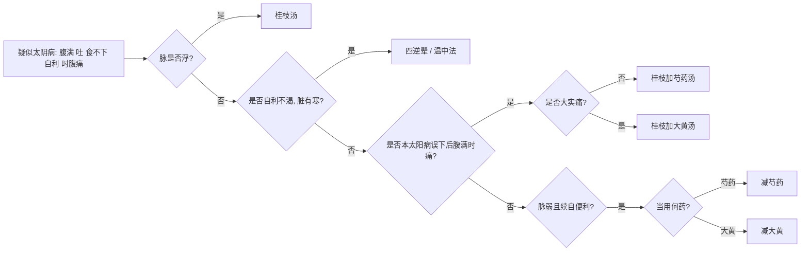

# 太阴病诊疗流程

## 基本定义与识别要点
**太阴病**属脾阳虚，寒湿内盛的里寒证。
**脉证提纲：** 太阴之为病，腹满而吐，食不下，自利益甚，时腹自痛。若下之，必胸下结硬。

## 太阴病辨证决策树

## 首选方剂与对照表

| 症状特征 | 脉象 | 诊断 | 首选方剂 | 常见加减/变证 |
| --- | --- | --- | --- | --- |
| 腹满、呕吐下利、不渴 | 缓弱 | 太阴虚寒证 | 四逆辈（原文未直指理中丸） | 重点是温中散寒，不宜误下 |
| 腹满时痛 (误下后) | 浮缓 | 太阴脾络不和 | 桂枝加芍药汤 | 若大实痛可加大黄 |

## 基本用药条件与禁忌
- **禁忌：** 禁用下法，误下必致“胸下结硬”。治疗以温中散寒为主。

## 太阴篇原文方剂补全清单

| 条文 | 方剂 | 关键证候 | 提示 |
| --- | --- | --- | --- |
| 276 | **桂枝汤** | 太阴病脉浮者，可发汗 | 太阴兼表，可借太阳法 |
| 277 | **四逆辈** | 自利、不渴，属太阴，脏有寒 | 原文未细列，主旨是温中散寒 |
| 279 | **桂枝加芍药汤** | 本太阳病，医反下之，因尔腹满时痛，属太阴 | 太阴脾络不和 |
| 279 | **桂枝加大黄汤** | 上证而大实痛 | 太阴中夹里实 |
| 280 | 减芍药 / 减大黄 | 太阴病脉弱，其人续自便利 | 胃气弱者，下利者药量当减 |

## 太阴篇补充提醒

- 太阴篇方剂不多，但诊断重点很重要：**腹满、吐、食不下、自利益甚、时腹自痛**。
- 太阴证的核心不是“攻”，而是“温”；即便条文提到大黄，也是在 **大实痛** 的前提下小心使用。
- **特别校正：** 太阴篇 `277` 原文是“`当温之，宜服四逆辈`”，不应直接机械改写成“理中丸/汤”。理中丸在本项目中保留为 **霍乱篇、瘥后篇明确出现** 的方；太阴篇则以“`四逆辈 / 温中法`”表述更忠于原文。

## 太阴篇无方条文要点补全

| 条文范围 | 要点 | 已落入 md 的位置 |
| --- | --- | --- |
| 273 | 太阴提纲：腹满而吐，食不下，自利益甚，时腹自痛；误下则胸下结硬 | 本文件“基本定义与识别要点” |
| 274 | 太阴中风，四肢烦疼，阳微阴涩而长者，为欲愈 | 本表 |
| 275 | 太阴病欲解时，从亥至丑上 | 本表 |
| 278 | 脉浮而缓，手足自温，系在太阴；太阴当发身黄，若小便自利者不能发黄；七八日虽暴烦下利，日十余行，必自止 | 本表 |
| 280 | 太阴脉弱而续自便利者，若当用大黄、芍药，宜减之；下利者先煎芍药三沸 | 本文件“方剂补全清单” + 本表 |

> 太阴篇的“无方条文”主要承担 **提纲、欲解时、病势自止、药量轻重** 的判断作用。

