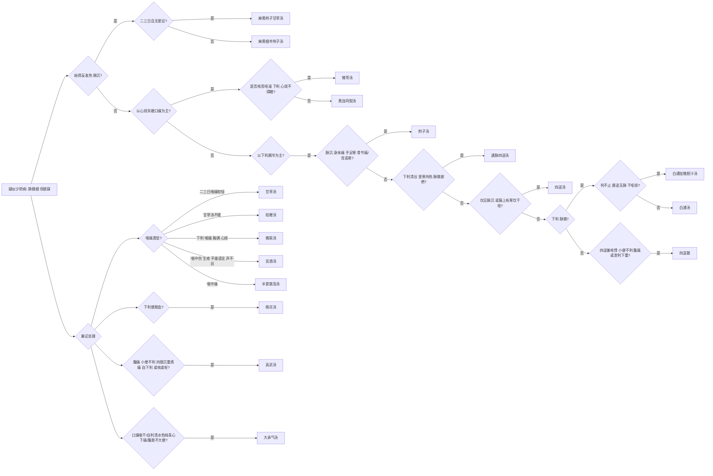

# 少阴病诊疗流程

## 基本定义与识别要点
**少阴病**为病邪深入心肾，多属全身性虚寒（或少部分虚热）。
**脉证提纲：** 少阴之为病，脉微细，但欲寐也。

## 少阴病辨证决策树

## 首选方剂与对照表

| 症状特征 | 脉象 | 诊断 | 首选方剂 | 常见加减/变证 |
| --- | --- | --- | --- | --- |
| 畏寒、倦卧、四肢厥冷、下利 | 沉微细 | 少阴寒化证 | 四逆汤 / 附子汤 | 病情极重用通脉四逆汤 |
| 心烦、失眠、口燥咽干 | 细数 | 少阴热化证 | 黄连阿胶汤 |
| 咽痛生疮、声不出 | 脉微 | 少阴咽痛证 | 桔梗汤等 | 
| 下利便脓血 | | 少阴兼证 | 桃花汤 |

## 基本用药条件与禁忌
- **禁忌：** 极忌发汗（会导致动血）与攻下。

## 少阴篇原文方剂补全清单

| 条文 | 方剂 | 关键证候 | 提示 |
| --- | --- | --- | --- |
| 301 | **麻黄细辛附子汤** | 少阴病始得之，反发热，脉沉 | 少阴寒化初起而兼表 |
| 302 | **麻黄附子甘草汤** | 少阴病二三日，无里证，宜微发汗 | 比前方更轻 |
| 303 | **黄连阿胶汤** | 少阴病二三日以上，心中烦，不得卧 | 少阴热化主方 |
| 304、305 | **附子汤** | 背恶寒；身体痛、手足寒、骨节痛、脉沉 | 少阴寒湿、阳虚痛证 |
| 306、307 | **桃花汤** | 下利便脓血，腹痛，小便不利 | 少阴下利脓血主方 |
| 309 | **吴茱萸汤** | 吐利，手足逆冷，烦躁欲死 | 少阴厥逆兼胃寒上逆 |
| 310 | **猪肤汤** | 下利、咽痛、胸满、心烦 | 养阴润燥、和中 |
| 311 | **甘草汤** / **桔梗汤** | 少阴病二三日，咽痛 | 轻重有别 |
| 312 | **苦酒汤** | 咽中伤、生疮、不能语言、声不出 | 咽喉重症 |
| 313 | **半夏散及汤** | 咽中痛 | 半夏有毒，原文特别提醒 |
| 314 | **白通汤** | 少阴病，下利 | 温通回阳 |
| 315 | **白通加猪胆汁汤** | 利不止，厥逆无脉，干呕，烦 | 胆汁、人尿引阳入阴 |
| 316 | **真武汤** | 腹痛、小便不利、四肢沉重疼痛、自下利，或咳或呕 | 少阴水气核心方 |
| 317 | **通脉四逆汤** | 下利清谷，里寒外热，手足厥逆，脉微欲绝 | 少阴危重救逆 |
| 318 | **四逆散** | 四逆，或咳、或悸、或小便不利、或腹中痛、或泄利下重 | 少阴枢机不利而非纯寒厥 |
| 319 | **猪苓汤** | 下利六七日，咳而呕、渴，心烦不得眠 | 少阴阴伤水热互结 |
| 320、321、322 | **大承气汤** | 口燥咽干；自利清水色纯青心下痛口干燥；腹胀不大便 | 少阴热化急下三条 |
| 323、324 | **四逆汤** | 脉沉者急温之；膈上有寒饮干呕 | 少阴寒化根本方 |

## 少阴篇补充提醒

- 少阴篇不能只看“`四逆汤` + `黄连阿胶汤`”两端，中间还有：
  - **轻表寒化：** `麻黄细辛附子汤`、`麻黄附子甘草汤`
  - **水气：** `真武汤`
  - **白通系统：** `白通汤`、`白通加猪胆汁汤`
  - **咽喉系统：** `猪肤汤`、`甘草汤`、`桔梗汤`、`苦酒汤`、`半夏散及汤`
  - **急下系统：** `大承气汤` 三条

## 少阴篇无方条文要点补全

| 条文范围 | 要点 | 已落入 md 的位置 |
| --- | --- | --- |
| 281-286 | 少阴提纲、欲吐不吐、心烦但欲寐、小便色白、亡阳、不可发汗、尺脉弱涩不可下 | 本文件“基本定义与识别要点”“禁忌” + 本表 |
| 287-291 | 自利后手足反温为欲解；恶寒蜷卧或欲去衣被为可治；少阴欲解时从子至寅 | 本表 |
| 292-300 | 吐利而发热可治、灸少阴、热在膀胱便血、强发汗动血、以及一组危候死证 | 本表 |
| 308 | 少阴病下利便脓血者，可刺 | 本文件方剂清单 + 本表 |
| 325 | 下利，脉微涩，呕而汗出，必数更衣反少者，当温其上，灸之 | 本表 |

> 少阴篇的非方剂条文很重要，因为它们承担了 **可治 / 不可治、可温 / 不可汗 / 不可下** 的判定功能。

