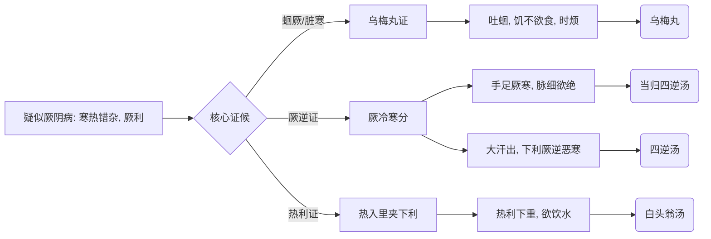

# 厥阴病诊疗流程

## 基本定义与识别要点
**厥阴病**为伤寒的最后阶段，寒热错杂。
**脉证提纲：** 厥阴之为病，消渴，气上撞心，心中疼热，饥而不欲食，食则吐蛔，下之利不止。

## 厥阴病辨证决策树

## 首选方剂与对照表

| 症状特征 | 脉象 | 诊断 | 首选方剂 | 常见加减/变证 |
| --- | --- | --- | --- | --- |
| 上热下寒、吐蛔、时烦 | 微弱 | 蛔厥/厥阴本病| 乌梅丸 | 禁生冷滑物 |
| 手足冷、脉细欲绝 | 细弱欲绝 | 血虚寒凝厥逆 | 当归四逆汤 | 内有久寒加吴茱萸生姜 |
| 热利下重、口渴 | 弦数 | 厥阴热利 | 白头翁汤 |

## 基本用药条件与禁忌
- **禁忌：** 诸四逆厥者不可下之，下之必利不止。

## 厥阴篇原文方剂补全清单

| 条文 | 方剂 | 关键证候 | 提示 |
| --- | --- | --- | --- |
| 338 | **乌梅丸** | 蛔厥，吐蛔，时烦，得食而呕，又烦；又主久利 | 厥阴主方 |
| 350 | **白虎汤** | 伤寒脉滑而厥，里有热 | 厥阴也有热厥 |
| 351 | **当归四逆汤** | 手足厥寒，脉细欲绝 | 血虚寒凝厥逆 |
| 352 | **当归四逆加吴茱萸生姜汤** | 上证而内有久寒 | 比当归四逆汤更重温里 |
| 353、354、377 | **四逆汤** | 大汗出热不去而下利厥逆恶寒；大下利而厥冷；呕而脉弱见厥 | 厥阴寒厥救逆 |
| 355 | **瓜蒂散** | 手足厥冷，脉乍紧，邪结胸中，心下满而烦，饥不能食 | 厥阴亦可用吐法 |
| 356 | **茯苓甘草汤** | 伤寒厥而心下悸，宜先治水 | 先治水，后治厥 |
| 357 | **麻黄升麻汤** | 大下后，寸脉沉迟，手足厥逆，唾脓血，泄利不止 | 复杂寒热错杂危证 |
| 359 | **干姜黄芩黄连人参汤** | 伤寒本自寒下，医复吐下，寒格，更逆吐下；食入口即吐 | 上热下寒、寒格吐逆 |
| 370 | **通脉四逆汤** | 下利清谷，里寒外热，汗出而厥 | 厥阴危重下利 |
| 371、373 | **白头翁汤** | 热利下重；下利欲饮水，以有热故也 | 厥阴热利主方 |
| 374 | **小承气汤** | 下利谵语，有燥屎 | 厥阴中亦有里实可下 |
| 375 | **栀子豉汤** | 下利后更烦，按之心下濡者，为虚烦 | 虚烦而非实痞 |
| 378 | **吴茱萸汤** | 干呕吐涎沫，头痛 | 厥阴寒饮上逆 |
| 379 | **小柴胡汤** | 呕而发热者 | 厥阴后段兼少阳枢机 |

## 厥阴篇补充提醒

- 厥阴不是只有 `乌梅丸` 一方，实际上至少要同时掌握三大组：
  - **寒厥：** `当归四逆汤`、`四逆汤`、`通脉四逆汤`
  - **热利：** `白头翁汤`
  - **寒热错杂 / 上热下寒：** `乌梅丸`、`干姜黄芩黄连人参汤`、`麻黄升麻汤`

## 厥阴篇无方条文要点补全

| 条文范围 | 要点 | 已落入 md 的位置 |
| --- | --- | --- |
| 326-337 | 厥阴提纲、欲解时、诸四逆厥不可下、先厥后热、厥热胜复、凡厥定义 | 本文件“基本定义”“禁忌” + 本表 |
| 339-349 | 热少微厥、小腹冷结、厥热多少判预后、灸法、生死判断 | 本表 |
| 358 | 腹中痛，若转气下趣少腹者，此欲自利也 | 本表 |
| 360-369 | 下利自愈脉象、无脉灸之、生死、清脓血判断、不可攻表、戴阳等 | 本表 |
| 376 | 呕家有痈脓者，不可治呕；脓尽自愈 | 本表 |
| 380-381 | 大吐大下大汗后哕；哕而腹满，视其前后，知何部不利，利之即愈 | 本表 |

> 厥阴篇大量条文并不是“开什么方”，而是在讲 **厥热转换规律、可治不可治、预后与误治禁忌**，这些现在也已进 md。

