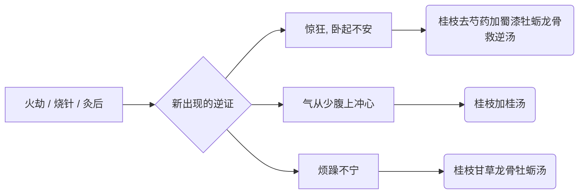

# 用药反应决策树 (误治与变证救治)

在使用某个汤剂或治疗手段（如发汗、吐下）后，患者可能会出现不同的反应。以下流程帮助你诊断不良反应并提供补救方案。

## 发汗后的补救决策树

```mermaid
graph LR
    A[发汗后] --> B{是否汗出而解?}
    B -- 是, 微似有汗 --> C[调养恢复 (啜热稀粥)]
    B -- 否, 汗出淋漓不止 --> D[表虚漏汗证]
    B -- 否, 发汗过多致变证 --> E[观察新症状]
    
    D --> D1[恶风, 小便难, 四肢急] --> D2(桂枝加附子汤)
    
    E --> E1[汗出喘而无大热] --> E2(麻杏石甘汤)
    E --> E3[叉手自冒心, 心下悸] --> E4(桂枝甘草汤)
    E --> E5[脐下悸, 欲作奔豚] --> E6(茯苓桂枝甘草大枣汤)
    E --> E7[腹胀满] --> E8(厚朴生姜半夏甘草人参汤)
    E --> E9[身疼痛, 脉沉迟] --> E10(桂枝加芍药生姜各一两人参三两新加汤)
    E --> E11[烦渴, 小便不利, 水入则吐] --> E12(五苓散)
    E --> E13[不渴而心下悸] --> E14(茯苓甘草汤)
    E --> E15[虚烦不得眠, 懊憹] --> E16(栀子豉汤类)
    E --> E17[发热不解, 头眩, 身瞤动, 振振欲擗地] --> E18(真武汤)
    E --> E19[烦躁恶寒 / 虚寒烦躁] --> E20{具体表现?}
    E20 -- 昼烦躁夜安静, 不呕不渴, 脉沉微 --> E21(干姜附子汤)
    E20 -- 发汗病不解, 反恶寒 --> E22(芍药甘草附子汤)
    E20 -- 发汗若下之, 病仍不解而烦躁 --> E23(茯苓四逆汤)
```

## 误下后的补救决策树

```mermaid
graph LR
    A[误下后] --> B{症状表现}
    B --> B1[下利不止, 脉促, 表未解] --> B2(葛根黄芩黄连汤)
    B --> B3[心下痞满 (不痛)] --> B4{痞证细分?}
    B4 -- 但满而不痛 --> B41(半夏泻心汤)
    B4 -- 干噫食臭, 腹中雷鸣下利 --> B42(生姜泻心汤)
    B4 -- 谷不化, 下利日数十行, 干呕心烦 --> B43(甘草泻心汤)
    B4 -- 按之濡, 关上浮 --> B44(大黄黄连泻心汤)
    B4 -- 痞而复恶寒汗出 --> B45(附子泻心汤)
    B --> B5[结胸证 (心下硬痛)] --> B6{结胸层级?}
    B6 -- 项亦强, 如柔痉状 --> B61(大陷胸丸)
    B6 -- 热实结胸, 石硬不可近 --> B62(大陷胸汤)
    B6 -- 小结胸, 按之则痛, 脉浮滑 --> B63(小陷胸汤)
    B --> B7[热结膀胱, 少腹急结, 如狂] --> B8(桃核承气汤)
    B --> B9[少腹硬满, 小便自利, 发狂/如狂] --> B10{小便情况?}
    B10 -- 小便自利, 其人如狂 --> B101(抵当汤)
    B10 -- 应小便不利, 今反利 --> B102(抵当丸)
    B --> B11[表里不解, 协热下利, 心下痞硬] --> B12(桂枝人参汤)
```

## 火逆 / 烧针后的补救决策树



## 响应诊断对照

| 前期治疗 | 新现症状 (问题 ✗) | 诊断标准 | 补救方剂 |
| --- | --- | --- | --- |
| 发汗 | 汗出不解，大汗大渴脉洪大 | 热盛伤津入里 | 白虎加人参汤 |
| 发汗 | 汗出漏不止，恶风肢急 | 阳气外越表不固 | 桂枝加附子汤 |
| 发汗 | 烦渴，小便不利，或水入即吐 | 蓄水 / 水逆 | 五苓散 |
| 发汗 | 不渴而心下悸 | 水停胃中较轻 | 茯苓甘草汤 |
| 发汗 | 虚烦不得眠、心中懊憹 | 误汗吐下后虚烦 | 栀子豉汤类 |
| 发汗 | 发热不解，头眩，身瞤动 | 阳虚水动 | 真武汤 |
| 误下 | 结胸硬痛 | 按之痛，寸浮关沉 | 大/小陷胸汤 |
| 误下 | 心下痞满不痛 | 按之濡软 | 半夏/生姜/甘草泻心汤 |
| 误下 | 少腹急结，如狂 | 热结膀胱兼瘀热 | 桃核承气汤 |
| 误下/经久 | 少腹硬满，小便自利，发狂 | 蓄血证 | 抵当汤 / 抵当丸 |
| 误发汗/误下 | 烦躁、夜卧不安 | 虚损心烦 | 栀子豉汤类 / 茯苓四逆汤 |
| 火劫 / 烧针 | 惊狂卧起不安 | 火逆亡阳 | 桂枝去芍药加蜀漆牡蛎龙骨救逆汤 |
| 烧针 | 气从少腹上冲心 | 奔豚 | 桂枝加桂汤 |

