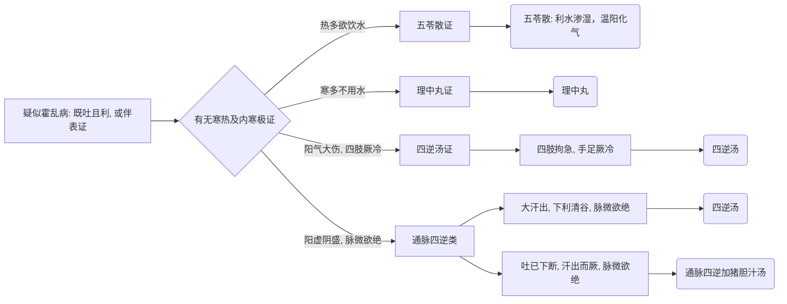

# 霍乱病诊疗流程

## 基本定义与识别要点
**霍乱病**在《伤寒论》中特指发病急暴，上吐下泻同时出现的病症。
**脉证提纲：** 呕吐而利，此名霍乱。或伴有发热、头痛、身疼、恶寒等表证。

## 霍乱病辨证决策树

## 首选方剂与对照表

| 症状特征 | 脉象 | 诊断 | 首选方剂 | 常见加减/变证 |
| --- | --- | --- | --- | --- |
| 吐利兼作，热多欲饮水 | 脉微 | 霍乱表里同病 (偏湿热) | 五苓散 | 多饮暖水取汗 |
| 吐利兼作，寒多不喜水 | 脉微 | 霍乱中阳虚寒 | 理中丸/汤 | 吐多去术加生姜等 |
| 吐利汗出，四肢厥冷 | 微欲绝 | 霍乱亡阳厥逆 | 四逆汤 | 极重者加人参 (四逆加人参汤) |
| 吐利已止，厥冷，脉欲绝 | 微欲绝 | 阴液耗竭，阳无所附 | 通脉四逆加猪胆汁汤 | 猪胆汁引阳入阴 |

## 恢复期注意
- 吐利止而身痛不休者，属表证未解，宜用 **桂枝汤** 小和之。
- 吐利、发汗后，脉平而有小烦，此为新虚不胜谷气（脾胃气弱，进食后产生的反应），需注意饮食清淡。

## 霍乱篇原文方剂补全清单

| 条文 | 方剂 | 关键证候 | 提示 |
| --- | --- | --- | --- |
| 385 | **四逆加人参汤** | 恶寒、脉微而复利，利止，亡血 | 霍乱后气血俱伤 |
| 386 | **五苓散** | 霍乱，热多欲饮水 | 偏热偏渴 |
| 386 | **理中丸 / 理中汤** | 霍乱，寒多不用水 | 偏寒偏虚 |
| 387 | **桂枝汤** | 吐利止而身痛不休 | 表证未解，小和其外 |
| 388、389 | **四逆汤** | 吐利汗出，发热恶寒，四肢拘急，手足厥冷；或大汗出下利清谷脉微欲绝 | 霍乱亡阳主方 |
| 390 | **通脉四逆加猪胆汁汤** | 吐已下断，汗出而厥，脉微欲绝 | 引阳入阴，危证救逆 |

## 霍乱篇补充提醒

- 霍乱篇条文不长，但层次非常清楚：**偏热用五苓、偏寒用理中、亡阳用四逆、将脱用通脉四逆加猪胆汁汤**。

## 霍乱篇无方条文要点补全

| 条文范围 | 要点 | 已落入 md 的位置 |
| --- | --- | --- |
| 382-383 | 霍乱定义：呕吐而利；或发热、头痛、身疼、恶寒、吐利 | 本文件“基本定义与识别要点” |
| 384 | 霍乱与伤寒转阴、阳明便硬、自愈时序的鉴别 | 本表 |
| 391 | 吐、利、发汗后，脉平而小烦，是新虚不胜谷气 | 本文件“恢复期注意” + 本表 |

> 霍乱篇现在已同时覆盖：定义、与伤寒转经鉴别、方剂、恢复期判断。

